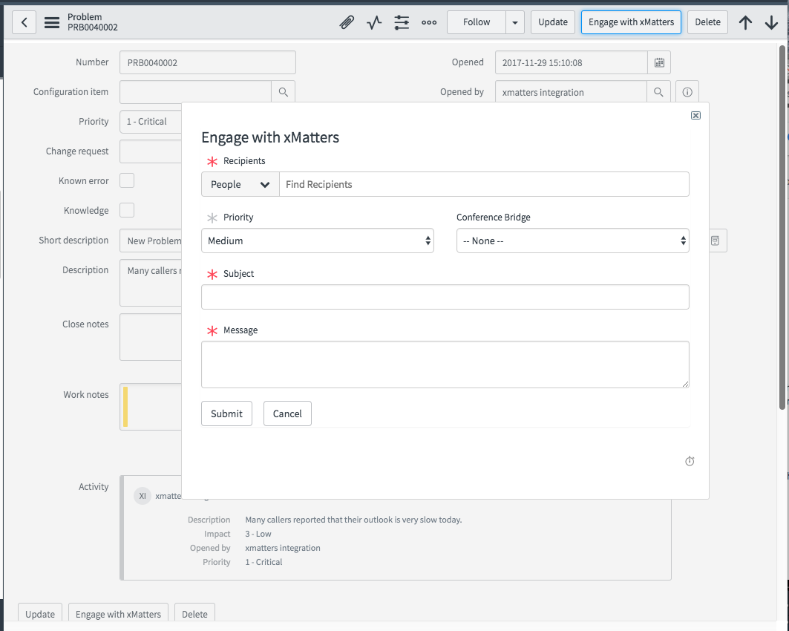

# Engage with xMatters for Problem Management in ServiceNow
The current Engage with xMatters works great for Incidents. This Add-on adds the Engage functionality to the Problem Management module in ServiceNow. It currently only does outbound to xMatters, but adding the closed loop portion would be relatively easy. 

<kbd>
  
</kbd>

# Pre-Requisites
* Version 4.0.2+ of the [xMatters App](https://store.servicenow.com/sn_appstore_store.do#!/store/application/5950d7444f2231000e9fa88ca310c78c/) in the ServiceNow store. 
* ServiceNow Helsinki, Istanbul or Jakarta
* xMatters account - If you don't have one, [get one](https://www.xmatters.com)!

# Files
* [ServiceNow40ProblemManagement.zip](ServiceNow40ProblemManagement.zip) - The Problem Management Comm Plan. Currently only has an Engage with xMatters form. 
* [ServiceNow-Engage-Problem-UpdateSet.xml](ServiceNow-Engage-Problem-UpdateSet.xml) - Update set for loading into ServiceNow.

# How it works
A new UI Action button on an open Problem record will display the Enage with xMatters dialog requesting recipients, sending priority, a subject and a message. 


<kbd>
  
</kbd>


After clicking submit, the information is populated into an Engage with xMatters Problem record and the insert triggers a business rule. The business rule adds an entry to the event queue in ServiceNow, which fires a Script Action. The Script Action makes the REST call into the inbound integration builder which then creates the event in xMatters and notifies the recipients. 

# Installation

## xMatters set up

1. Login to xMatters as a Company Supervisor and navigate to the Developer tab. 
2. Import the [ServiceNow40ProblemManagement.zip](ServiceNow40ProblemManagement.zip) Comm Plan. 
2. Next to the `ServiceNow 4.0 - Problem Management` Comm Plan, click Edit > Integration Builder and expand the Inbound Integrations. 
3. Click on the `Engage with xMatters - Problem` integration, scroll to the bottom and copy the url. Keep this for later. 
4. Repeat for the `Conference - Problem` integration. 

## ServiceNow set up

### Import the update set

1. Login to ServiceNow and navigate to Retrieved Update Sets. 
2. Click the Import Update Set from XML link at the bottom and point to the [ServiceNow-Engage-Problem-UpdateSet.xml](ServiceNow-Engage-Problem-UpdateSet.xml) file. 
3. Preview the update set and commit. This is all net new records so there should not be any files overwritten.

### Configure ServiceNow

1. Navigate to Script Includes and search for `xMattersConfigProblem`. 
2. Open the record and look for this section and update each entry with the url copied above. 

```
		this.ENGAGE = {
			FORM: {
				ENGAGE: "Engage with xMatters - Problem URL here",
				CONFERENCE: "Conference - Problem URL here"
			}
		};
```


# Testing
Navigate to an existing Problem record and click the `Engage with xMatters` button in the upper right. This will display the Engage with xMatters dialog:

<kbd>
  
</kbd>

Enter the required fields and hit Submit. A new event will be created in xMatters and notifications will be sent targeting the recipients. If a conference bridge was selected, they will be invited to a conference. 


# Troubleshooting

The first place to check is the Activity Stream in the Integration Builder for the expected inbound integration. If an entry is there for the Engage request, then ServiceNow successfully made the request and the task is to determine why an event was not created. 

If the Activity Stream entry does not exist, then ServiceNow did not make the request and the System Log in ServiceNow should be consulted for more information. 

